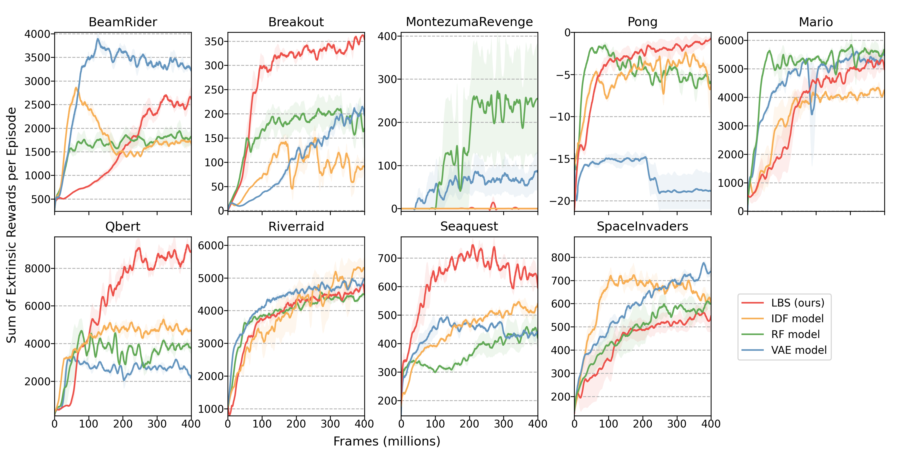

## Abstract

The human intrinsic desire to pursue knowledge, also known as curiosity, is considered essential in the process of skill acquisition. With the aid of artificial curiosity, we could equip current techniques for control, such as Reinforcement Learning, with more natural exploration capabilities. 
A promising approach in this respect consists of using Bayesian surprise on model parameters, i.e. a metric for the difference between prior and posterior beliefs, to favour exploration. In this contribution, we propose to compute Bayesian surprise in a latent space, representing the agent’s current understanding of the dynamics of the system, drastically reducing computational cost.
We extensively evaluate our method by measuring the agent's performance in terms of environment exploration, for continuous tasks, and looking at the game scores achieved, for video games. Our model is computationally cheap and compares positively with current state-of-the-art methods on several problems. We also investigate the effects caused by stochasticity in the environment, which is often a failure case for curiosity-driven agents. In this regime, the results suggest that our approach is more resilient to stochastic transitions.

### Arcade Games Experiments

The curves show the game score achieved during an episode of training. Agents learn using only the intrinsic motivation signal.

    

To incentivize comparison against our baseline, we make public the data used in the plots, which can be easily integrated with the original [Large-Scale Study of Curiosity-Driven Learning](https://github.com/openai/large-scale-curiosity) open-source implementation.

<a href="/resources/lbs_arcade_results.zip" download>Download Data [.zip]</a>

They follow videos of the agents playing the games, driven only by their curiosity.

    

    <h4> BeamRider </h4> 
        <video style=' background-color: rgba(0, 0, 0, 0)' src="./resources/BeamRider-6140.mp4" width="90%" controls preload></video>
    

    

    <h4> Breakout </h4> 
        <video style=' background-color: rgba(0, 0, 0, 0)' src="./resources/Breakout-425.mp4" width="90%" controls preload></video>
    

    

    <h4> Montezuma Revenge</h4> 
        <video style=' background-color: rgba(0, 0, 0, 0)' src="./resources/MontezumaRevenge-left-bugs.mp4" width="90%" controls preload></video>
    

    

    <h4> Pong </h4>
        <video style=' background-color: rgba(0, 0, 0, 0)' src="./resources/Pong-2-4.mp4" width="90%" controls preload></video>
    

    

        <h4> Qbert </h4>
        <video style=' background-color: rgba(0, 0, 0, 0)' src="./resources/Qbert-15600.mp4" width="90%" controls preload></video>
    

    

        <h4> Riverraid</h4>
        <video style=' background-color: rgba(0, 0, 0, 0)' src="./resources/Riverraid-6890.mp4" width="90%" controls preload></video>
    

    

        <h4> Seaquest</h4>
        <video style=' background-color: rgba(0, 0, 0, 0)' src="./resources/Seaquest-1060.mp4" width="90%" controls preload></video>
    

    

        <h4> Space Invaders</h4>
        <video style=' background-color: rgba(0, 0, 0, 0)' src="./resources/SpaceInvaders-1370.mp4" width="90%" controls preload></video>
    

<h4> Super Mario Bros.</h4>

    

    

        <video style=' background-color: rgba(0, 0, 0, 0)' src="./resources/MarioBros-pipe-world-1.mp4" width="90%" controls preload></video>
    

    

        <video style=' background-color: rgba(0, 0, 0, 0)' src="./resources/MarioBros-all-world-1.mp4" width="90%" controls preload></video>
    

    

